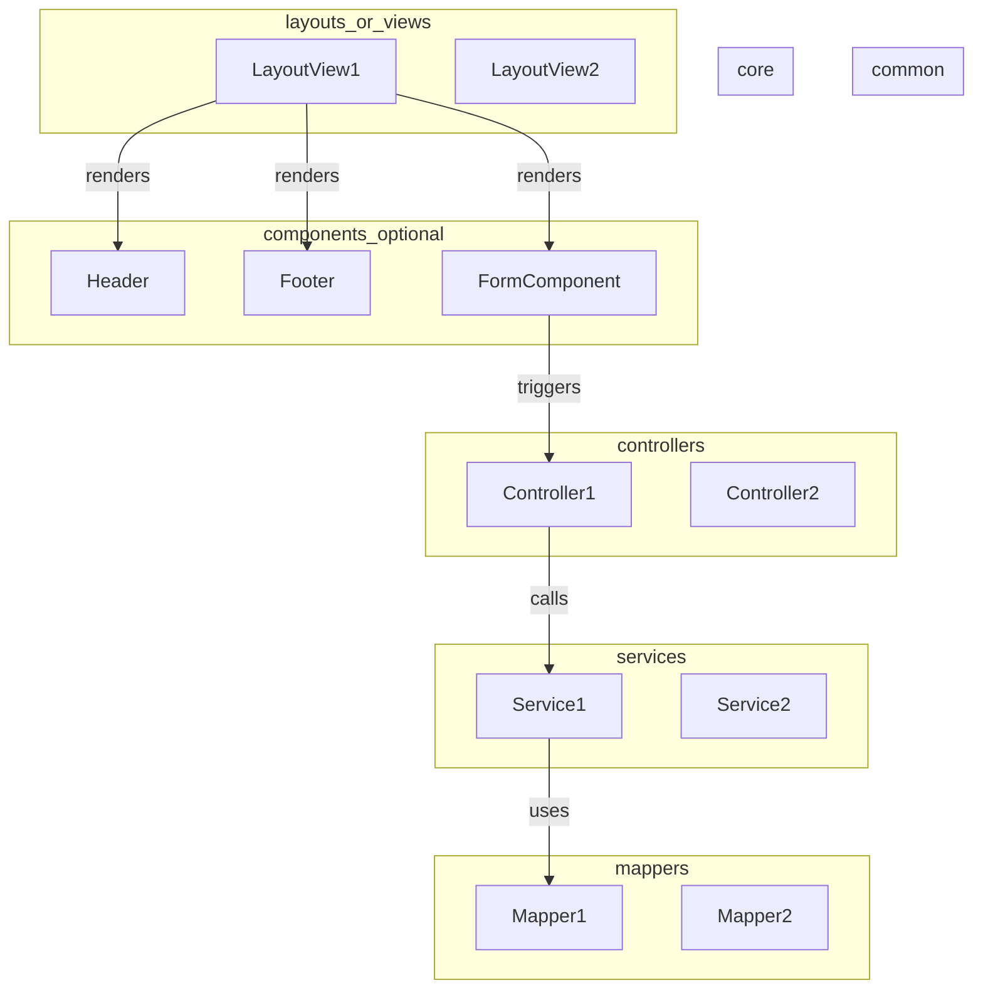
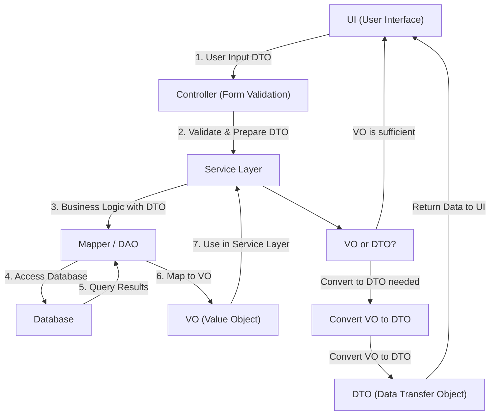

# 💥 Python Streamlit을 이용해서 VitminStudio 개발

## 1. 개발 환경

-   python 3.11
-   poetry
-   필요 Package 설치

    ```shell
    poetry init

    poetry add streamlit \
               streamlit-authenticator \
               pydantic \
               sqlalchemy \
               toml \
               oracledb \
               psycopg2 \
               chardet \

    ```

-   설치해 보면서 확인해야 할것 들.

    ```shell
    poetry add streamlit_option_menu
               streamlit_js \
               streamlit-cookies-controller \
               streamlit-aggrid
    ```

## 1.1 Lint 설정

-   필요 package 설치

    ```shell
    poetry add autopep8 flake8 isort

    ```

-   .vscode/settings.json

    ```json

    {
        "python.analysis.typeCheckingMode": "off",
        "python.linting.enabled": true,
        "python.linting.flake8Enabled": true,
        "python.linting.flake8Args": ["--max-line-length=160"],
        "python.linting.lintOnSave": true,
        "python.formatting.provider": "autopep8",
        "editor.formatOnSave": true,
        "python.testing.unittestEnabled": false,
        "python.testing.pytestEnabled": true,
        "sonarlint.connectedMode.project": {
        "connectionId": "http-localhost-8085",
            "projectKey": "vs-streamlit"
        },
    // 특정 파일 확장자에 대해 자동 포매팅 비활성화
    "[sql]": {
            "editor.formatOnSave": false,
            "editor.formatOnType": false
        },
    "[md]": {
            "editor.formatOnSave": false,
            "editor.formatOnType": false
        }
    }

        ```

-   isort

    Black이 잡아주지 못하는, import 순서 정렬해 주는 기능을 담당합니다
    파이썬 built-in 모듈인지, first party 모듈인지, third party 모듈인지도 구분해 줍니다.

-   Flake8

    앞선 두 코드 품질 관리 도구가 형식적인 측면을 잡아주는 반면, 개발자의 실수가 유발될 수 있는 의미적인 스타일도 교정해 줍니다.
    주로 import 하고 사용하지 않는 모듈의 존재나 모든 오류를 잡으려 하는 try 문 등을 지적합니다.

-   vscode extension 설치

    ```
    flake8, autopep8
    ```

## 2. 구조



## 3. VO, DTO, DAO 적극 활용

### 3.1 VO (Value Object)

-   정의: VO는 값 그 자체를 표현하는 객체로, 불변성을 가지며, 동일한 속성을 가지는 객체는 동일한 것으로 간주됩니다.
    VO는 주로 시스템 내에서 의미 있는 단위의 데이터를 나타냅니다.
-   역할: VO는 주로 비즈니스 로직에서 사용되며, 두 VO 객체가 동일한지 비교하는 데 사용됩니다.
-   예시: Money, Address, Coordinates 등이 VO의 예입니다.

### 3.2 DTO (Data Transfer Object)

-   정의: DTO는 계층 간 데이터 전송을 위한 객체로, 주로 데이터베이스에서 데이터를 가져와 클라이언트에 전달하거나,
    클라이언트에서 서버로 데이터를 보낼 때 사용됩니다. DTO는 일반적으로 순수한 데이터 컨테이너로, 로직이 포함되지 않습니다.
-   역할: DTO는 주로 데이터 전송을 목적으로 하며, 데이터의 구조를 정의하고 검증하는 데 사용됩니다.
-   예시: UserDTO, ProductDTO 등이 있습니다.

### 3.3 DAO (Data Transfer Object) -> 여기서는 Mapper로 대신

-   정의: DAO는 데이터베이스에 접근하여 데이터를 조회하거나 조작하는 객체입니다. DAO는 데이터베이스와의 모든 상호작용을 캡슐화하며,
    주로 CRUD(Create, Read, Update, Delete) 작업을 수행합니다.
-   역할: DAO는 데이터베이스와 직접 상호작용하며, 데이터를 영속성 계층에 저장하거나 읽어오는 역할을 합니다.
-   예시: UserDAO, OrderDAO 등이 있습니다.

### 3.4 흐름

-   DTO : UI -> Controller -> Service -> Mapper
-   VO : Mapper -> Service -> Controller
-   VO : Mapper -> Service -> DTO -> Controller



## 4. 폴더 구조

```
vitaminstudio
 ├── .streamlit                         # Streamlit 설정 파일
 ├── docker                             # docker Dockerfile, docker-compose.yml 파일
 ├── misc                               # 기타
 │ └── sqlscript                        # SQL 관련 Script
 │   └── sqlite                         # SQLite 관련 Script
 ├── src                                # 소스
 │ ├── app                              # VitaminStudio app 소스
 │ │ ├── main                           # 로그인 이후의 메인
 │ │ │ └── views                        # View 페이지 코드
 │ │ ├── modelqc                        # 모델 품질관리
 │ │ ├── users                          # 사용자
 │ │ │ ├── components                   # 컴포넌트 관련 코드
 │ │ │ ├── controllers                  # Callback 관련 정의 코드
 │ │ │ ├── mappers                      # SQL 관련 코드 정의
 │ │ │ ├── schemas                      # Schema 관련 코드 정의
 │ │ │ │ ├── dto                        # Request, Response 관련 Schema 코드 정의
 │ │ │ │ └── vo                         # SQL Result 관련 Schema 코드 정의
 │ │ │ ├── services                     # 실제 Business 로직 관련 코드 정의
 │ │ │ └── views                        # View 페이지 코드
 │ │ ├── worddict                       # 데이터 표준화 관리
 │ │ └── app_vitaminstudio.py           # main app
 │ ├── common                           # DB와 관련하여 공통으로 사용하는 모듈
 │ │ ├── controllers                    # Callback 관련 정의 코드
 │ │ ├── mappers                        # SQL 관련 코드 정의
 │ │ ├── schemas                        # Schema 관련 코드 정의
 │ │ │ ├── dto                          # Request, Response 관련 Schema 코드 정의
 │ │ │ └── vo                           # SQL Result 관련 Schema 코드 정의
 │ │ └── services                       # 실제 Business 로직 관련 코드 정의
 │ ├── core                             # 공통으로 사용하는 모듈
 │ │ ├── configs                        # 설정과 관련된 코드 정의
 │ │ ├── constants                      # const, enum 관련된 코드 정의
 │ │ ├── databases                      # database connection, transaction 관련된 코드 정의
 │ │ │ ├── local                        # local database 관련 코드 정의
 │ │ │ └── server                       # server database 관련 코드 정의
 │ │ ├── exceptions                     # exception 관련 코드 정의
 │ │ ├── loggers                        # logger 관련 코드 정의
 │ │ ├── sessions                       # streamlit session_state 관련 코드 정의
 │ │ │ └── schemas                      # session에 담는 schema 코드 정의
 │ │ ├── singletons                     # 메모리에 올려 놓고 사용할 코드 정의
 │ │ └── utilities                      # utility 관련 코드 정의
 │ ├── samples                          # 이것저것 테스트 관련된 코드 정의
 │ └── tests                            # test 코드 정의
 ├── volumes                            # app에서 생산되는 로그, 데이터베이스 관련 정의
 │ ├── database                         # 데이터베이스 관련
 │ └── logs                             # 로그 관련
 └── run.sh                             # app 실행 쉘

```

## 참고

### 1. emoji

    > https://gist.github.com/rxaviers/7360908

    > https://emojidb.org/streamlit-emojis

### 2. sonarqube

```
- 프로젝트 명 : vs-streamlit
- 프로젝트 키 : sqp_8b81784e727bac329de1691f88e6da469b380aee
```

### 3. sonar-scanner

-   sonar-scanner.properties

    ```
        #Configure here general information about the environment, such as SonarQube server connection details for example
        #No information about specific project should appear here

        #----- Default SonarQube server
        #sonar.host.url=http://localhost:9000

        #----- Default source code encoding
        sonar.sourceEncoding=UTF-8
    ```

-   실행

```shell
D:\Utility\dev_tool\sonar\sonar-scanner-5.0.1.3006-windows\bin\sonar-scanner.bat -D"sonar.projectKey=vs-streamlit" -D"sonar.sources=." -D"sonar.host.url= http://localhost:8085" -D"sonar.login=sqp_8b81784e727bac329de1691f88e6da469b380aee" -D"sonar.projectBaseDir=D:\source\workspace-misc\workspace-streamlit\vitaminstudio" -D"sonar.exclusions=**/.git/**, **/.venv/**, **/.vscode/**, docker/**, misc/**, src/samples/**, src/test/**, volumes/**"
```
