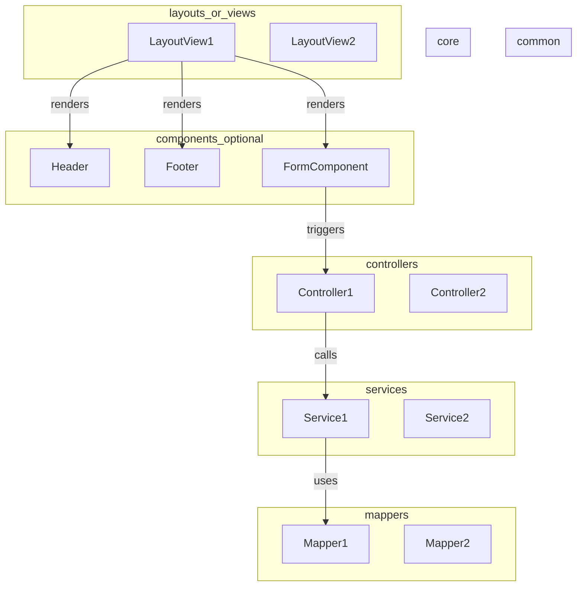
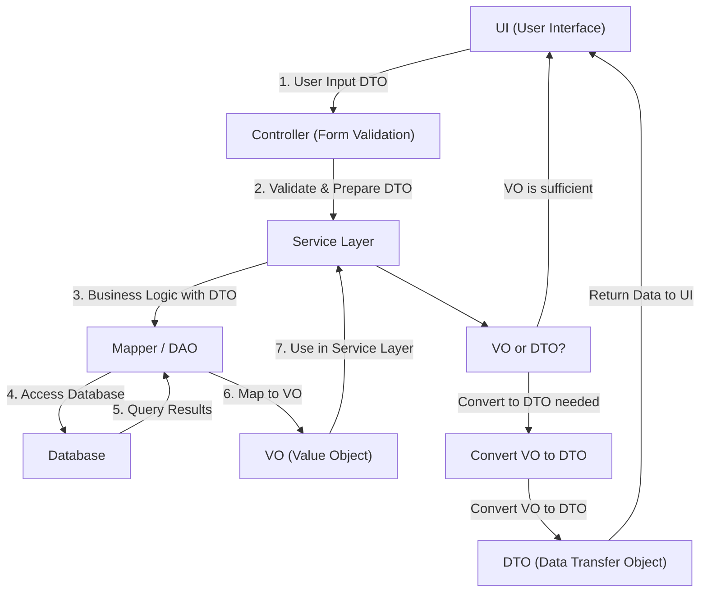

# 💥 Python Streamlit을 이용해서 VitminStudio 개발

## 1. 개발 환경

-   python 3.11
-   poetry
-   필요 Package 설치

    ```shell
    poetry init

    poetry add streamlit streamlit-authenticator streamlit_option_menu pydantic sqlalchemy toml oracledb psycopg2 chardet

    ```

## 1.1 Lint 설정

-   필요 package 설치

    ```shell
    poetry add autopep8 flake8 isort

    ```

-   .vscode/settings.json

    ```json
    {
        "python.analysis.typeCheckingMode": "off",
        "python.linting.enabled": true,
        "python.linting.flake8Enabled": true,
        "python.linting.flake8Args": ["--max-line-length=160"],
        "python.linting.lintOnSave": true,
        "python.formatting.provider": "autopep8",
        "editor.formatOnSave": true,
        "python.testing.unittestEnabled": false,
        "python.testing.pytestEnabled": true
    }
    ```

-   isort

    Black이 잡아주지 못하는, import 순서 정렬해 주는 기능을 담당합니다
    파이썬 built-in 모듈인지, first party 모듈인지, third party 모듈인지도 구분해 줍니다.

-   Flake8

    앞선 두 코드 품질 관리 도구가 형식적인 측면을 잡아주는 반면, 개발자의 실수가 유발될 수 있는 의미적인 스타일도 교정해 줍니다.
    주로 import 하고 사용하지 않는 모듈의 존재나 모든 오류를 잡으려 하는 try 문 등을 지적합니다.

-   vscode extension 설치

    ```
    flake8, autopep8
    ```

## 2. 구조



## 3. VO, DTO, DAO 적극 활용

### 3.1 VO (Value Object)

-   정의: VO는 값 그 자체를 표현하는 객체로, 불변성을 가지며, 동일한 속성을 가지는 객체는 동일한 것으로 간주됩니다.
    VO는 주로 시스템 내에서 의미 있는 단위의 데이터를 나타냅니다.
-   역할: VO는 주로 비즈니스 로직에서 사용되며, 두 VO 객체가 동일한지 비교하는 데 사용됩니다.
-   예시: Money, Address, Coordinates 등이 VO의 예입니다.

### 3.2 DTO (Data Transfer Object)

-   정의: DTO는 계층 간 데이터 전송을 위한 객체로, 주로 데이터베이스에서 데이터를 가져와 클라이언트에 전달하거나,
    클라이언트에서 서버로 데이터를 보낼 때 사용됩니다. DTO는 일반적으로 순수한 데이터 컨테이너로, 로직이 포함되지 않습니다.
-   역할: DTO는 주로 데이터 전송을 목적으로 하며, 데이터의 구조를 정의하고 검증하는 데 사용됩니다.
-   예시: UserDTO, ProductDTO 등이 있습니다.

### 3.3 DAO (Data Transfer Object) -> 여기서는 Mapper로 대신

-   정의: DAO는 데이터베이스에 접근하여 데이터를 조회하거나 조작하는 객체입니다. DAO는 데이터베이스와의 모든 상호작용을 캡슐화하며,
    주로 CRUD(Create, Read, Update, Delete) 작업을 수행합니다.
-   역할: DAO는 데이터베이스와 직접 상호작용하며, 데이터를 영속성 계층에 저장하거나 읽어오는 역할을 합니다.
-   예시: UserDAO, OrderDAO 등이 있습니다.

### 3.4 흐름

-   DTO : UI -> Controller -> Service -> Mapper
-   VO : Mapper -> Service -> Controller
-   VO : Mapper -> Service -> DTO -> Controller



# 참고

-   emoji

    > https://gist.github.com/rxaviers/7360908

    > https://emojidb.org/streamlit-emojis
